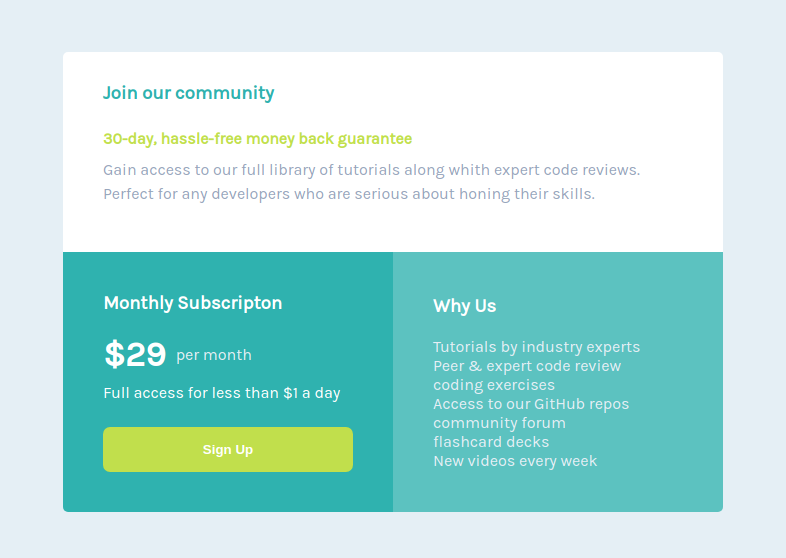

# Single price grid component
https://gridcomponent01.netlify.app/

## Sobre o projeto

Esta é uma solução do frontend Mentor com o objetivo de construir um componente de grade contendo um preço único  , e torná-lo o mais semelhante possível ao projeto original. Nele, o usuário deve ser capaz de visualizar o cartão em qualquer dispositivo.

## Layout Desktop

## layout Mobile

# Estilização utilizada

## Cores

### Primária

- Cyan: hsl(179, 62%, 43%)
- Bright Yellow: hsl(71, 73%, 54%)

### Neutra

- Light Gray: hsl(204, 43%, 93%)
- Grayish Blue: hsl(218, 22%, 67%)

## tipografia

### Body

- Font size: 16px

### Font

- Family: Karla
- Weights: 400, 700

# Tecnologias utilizadas

## Front end

- HTML / CSS 

### Modelos de layout utilizados:

- GridLayout
- FlexBox

## Implantação em produção

- Front end web: Netlify
  https://gridcomponent01.netlify.app/

# Challenge

- Frontend Mentor
  https://www.frontendmentor.io/solutions/flex-box-grid-layout-yqIEm2CYs
  
# Meu aprendizado neste projeto
  
  Com este projeto pude dar continuidade na pratica do grid-layout e na utilização do flex box em conjunto, assim como no meu outro projeto " Four Card Feature Section Master ".
  
# Autor

Wesley higino Pereira

https://www.linkedin.com/in/wesleyhigino/
